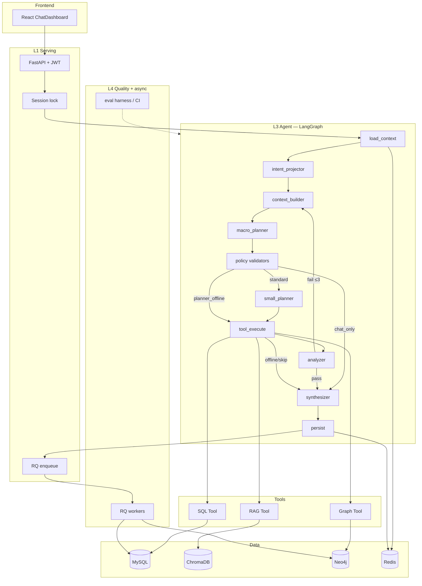

# Coach Agent

An AI-powered fitness coaching platform that combines multi-agent orchestration with structured exercise data, knowledge retrieval, and graph-based injury reasoning. Users chat with a personalized coach that understands their fitness level, available equipment, and injury constraints.

## What It Does

Coach Agent is a full-stack application:

- **Backend** — A FastAPI service with a LangGraph multi-agent orchestrator that plans, executes, and synthesizes responses using SQL, RAG, and graph tools.
- **Frontend** — A React chat interface for signup, profile management, and interactive coaching sessions.

The agent retrieves exercises from MySQL, searches fitness knowledge via ChromaDB vector search, and runs injury-aware reasoning over a Neo4j exercise graph — then synthesizes structured coaching responses with exercise recommendations and safety guidance.

## UI

## Why It's Useful


| Feature                          | Benefit                                                                                                      |
| -------------------------------- | ------------------------------------------------------------------------------------------------------------ |
| **Multi-tool agent**             | Combines structured queries (SQL), semantic search (RAG), and relationship reasoning (Neo4j) in one workflow |
| **Injury-aware recommendations** | Graph tool filters or substitutes exercises based on joint load and user injury profile                      |
| **Personalized coaching**        | User profiles (level, goals, equipment, injuries) persist in MySQL and Neo4j semantic memory                 |
| **Session memory**               | Redis-backed working memory keeps multi-turn conversations coherent                                          |
| **Streaming responses**          | SSE endpoint reduces time-to-first-token for a smoother chat experience                                      |
| **Quality evaluation**           | DeepEval and pytest suites for agent trajectory and RAG retrieval quality                                    |


## Architecture

Coach Agent uses a **plan–validate–refine** LangGraph pipeline (not open-ended ReAct). One user message runs through intent projection, policy-checked planning, parallel tool execution, optional analyzer retry, synthesis, and durable persistence.

### Runtime harness (L1–L4)

Production behavior is wrapped in a **Runtime Agent Harness** — see `[harness.md](harness.md)` and `[conclusion.md](conclusion.md)` for the full roadmap.


| Layer             | Role in this repo                                                            |
| ----------------- | ---------------------------------------------------------------------------- |
| **L1 Serving**    | JWT auth, per-session lock (`app/serving/`), Redis RQ background jobs        |
| **L2 Guardrails** | Policy validators, analyzer loop; input/output guards planned (Phase 3)      |
| **L3 Agent**      | LangGraph orchestrator, IntentState, three-tier memory, tool contracts       |
| **L4 Quality**    | `app/eval/harness.py`, DeepEval + Ragas, CI `eval-unit`, baseline regression |


### System overview




### Agent flow (one turn)

1. **L1** — Authenticate JWT; acquire per-`session_id` lock (409 if another turn is in flight).
2. **load_context** — Load Redis working memory (MySQL backfill on miss); fetch Neo4j semantic profile (injuries, equipment, level).
3. **intent_projector** — Project structured `IntentState` (slots, `routing_hint`, `rag_intent_hint`) from user input + lexicon.
4. **context_builder** — Compile prioritized planner context (P0–P3 segments: request, profile, summary, trimmed history).
5. **macro_planner** — Choose `routing_mode` and tool topology (`standard` / `chat_only` / offline fallback).
6. **policy validators** — Code-level checks inject `graph_tool` when safety or injury-profile rules require it.
7. **small_planner** — Fill typed Pydantic params per tool (`SQLSearchSchema`, `RAGSearchSchema`, graph scenarios).
8. **tool_execute** — Dependency-aware async scheduler (e.g. SQL candidates → graph `injury_avoidance`); tenacity retry + graceful degradation.
9. **analyzer** — LLM judges completeness/safety; on fail → feedback to Redis → retry from `context_builder` (recompile planner context with P0 feedback; `IntentState` unchanged, max 3).
10. **synthesizer** — Build structured `CoachResponse` (greeting, guidance, exercises, safety alerts).
11. **persist** — Append to Redis (4-turn sliding window + summarize-on-prune); enqueue RQ jobs (chat log, training log, consolidation, memory summarize, plan audit).

**Memory tiers:** hot (Redis, last 4 turns) → warm (`session_summary` + `state_patch`) → cold (Neo4j/MySQL profile). Consolidation to Neo4j runs on triggers via RQ, not every turn.

**Sync vs async:** User-facing latency = LangGraph + Redis only. Heavy LLM/DB work (logs, consolidation, summarize) → durable **Redis RQ** queues (`coach_high` / `coach_medium` / `coach_low`) with idempotent job IDs.

## Project Structure

```
coach-agent/
├── harness.md              # Runtime + Coding harness sprint & roadmap
├── conclusion.md           # Architecture review & improvement plan
├── backend/
│   ├── app/
│   │   ├── agent/
│   │   │   ├── orchestrator.py      # CoachOrchestrator + graph node handlers
│   │   │   ├── graph/               # LangGraph state machine (coach_graph.py)
│   │   │   ├── intent/              # IntentState, FitnessLexicon, projector
│   │   │   ├── context/             # Context builder, planner history trim
│   │   │   ├── policy/              # intent_validators, joint-sensitive terms
│   │   │   ├── memory/              # Working memory, consolidator, summarize
│   │   │   ├── roles/               # macro/small planners, synthesizer, sanitizer
│   │   │   ├── prompts/             # system_prompts, skill_guide
│   │   │   └── analyzer.py
│   │   ├── api/                     # FastAPI routes + JWT auth
│   │   ├── serving/                 # L1: session lock (rate limit planned)
│   │   ├── queue/                   # L1: RQ connection, jobs, enqueue_after_turn
│   │   ├── eval/                    # L4: harness CLI, Ragas, DeepEval, routing eval
│   │   │   ├── harness.py
│   │   │   ├── datasets/smoke/      # Public smoke JSON (CI + local sanity)
│   │   │   ├── metrics/             # agent_metrics, tool_trace
│   │   │   └── reporters/           # baseline, CSV
│   │   ├── database/                # MySQL, Neo4j, ChromaDB clients
│   │   ├── models/                  # Pydantic schemas (CoachResponse, memory, fitness)
│   │   └── tools/                   # sql_tool, rag_tool, graph_tool
│   ├── data/
│   │   ├── coach_agent_db.sql       # MySQL DDL (catalog + users; extend for chat/audit)
│   │   ├── chroma/                  # Local vector store (generated)
│   │   └── book_source/             # Fitness textbook source (e.g. CSCS.md)
│   ├── scripts/
│   │   ├── rq_worker.py             # Background job worker
│   │   ├── sync_to_chroma*.py       # Vector / knowledge ingestion
│   │   └── sync_to_neo4j.py
│   ├── tests/
│   │   ├── agent/                   # Intent, routing, context, agent quality
│   │   ├── eval/                    # Harness unit tests (CI eval-unit)
│   │   ├── memory/                  # Working memory + consolidation
│   │   ├── queue/                   # enqueue_after_turn, semantic init
│   │   ├── serving/                 # Session lock tests
│   │   └── tools/                   # RAG quality, retry resilience
│   ├── .env.example
│   └── requirement.txt
├── frontend/
│   └── src/                         # React ChatDashboard, API client (JWT)
├── .cursor/skills/
│   └── coach-agent-dev/SKILL.md     # Coding-agent dev guide (Cursor)
└── .github/
    └── workflows/eval.yml           # eval-unit (+ optional eval-smoke)
```

**Key docs:** `[harness.md](harness.md)` (active sprint), `[conclusion.md](conclusion.md)` (full harness design). Deeper dev notes: `.cursor/skills/coach-agent-dev/SKILL.md`.

## Prerequisites

- **Python** 3.10+
- **Node.js** 18+ and npm
- **MySQL** 8.x
- **Redis**
- **Neo4j** (Aura cloud or self-hosted)
- **API keys** for an OpenAI-compatible LLM, DashScope (Qwen embeddings), and optionally DeepSeek

## Getting Started

### 1. Clone the repository

```bash
git clone https://github.com/zhe0328/coach-agent.git
cd coach-agent
```

### 2. Backend setup

```bash
cd backend
python -m venv venv
source venv/bin/activate   # Windows: venv\Scripts\activate
pip install -r requirement.txt
cp .env.example .env       # then edit .env with your values
```

### 3. Initialize the database

```bash
mysql -u root -p < data/coach_agent_db.sql
```

Load exercise data into your MySQL instance (if you have a separate data import), then sync to vector and graph stores:

```bash
# From backend/ with venv activated
export PYTHONPATH=.

python scripts/sync_to_chroma.py              # Exercise vectors → ChromaDB
python scripts/sync_to_chroma_knowledge.py    # Book knowledge → ChromaDB
python scripts/sync_to_neo4j.py               # Exercise graph → Neo4j
```

### 4. Start the backend

```bash
cd backend
source venv/bin/activate
uvicorn app.api.main:app --reload --host 0.0.0.0 --port 8000
```

API docs are available at [http://localhost:8000/docs](http://localhost:8000/docs).

### 5. Start the frontend

```bash
cd frontend
npm install
npm start
```

The app runs at [http://localhost:3000](http://localhost:3000). The API client points to `http://127.0.0.1:8000` — update `frontend/src/api/client.js` if your backend URL differs.

## Usage Examples

### Chat with the coach (non-streaming)

```bash
curl -X POST http://localhost:8000/v1/chat/static \
  -H "Content-Type: application/json" \
  -d '{
    "session_id": "550e8400-e29b-41d4-a716-446655440000",
    "user_id": 1,
    "message": "I have knee pain. What leg exercises can I do at home?"
  }'
```

### Streaming chat (SSE)

```bash
curl -N -X POST http://localhost:8000/v1/chat \
  -H "Content-Type: application/json" \
  -d '{"message": "Recommend a beginner chest workout with dumbbells"}'
```

### Get exercise details

```bash
curl http://localhost:8000/v1/exercises/0001
```

### User signup

```bash
curl -X POST http://localhost:8000/v1/user/signup \
  -H "Content-Type: application/json" \
  -d '{
    "username": "demo_user",
    "password": "secure_password",
    "gender": "other",
    "weight_kg": 70,
    "height_cm": 175,
    "fitness_level": "beginner",
    "fitness_goal": "muscle gain",
    "equipments": "dumbbells",
    "injuries": "knee"
  }'
```

## API Overview


| Method | Endpoint                  | Description                             |
| ------ | ------------------------- | --------------------------------------- |
| `POST` | `/v1/chat`                | Streaming coach response (SSE)          |
| `POST` | `/v1/chat/static`         | Full coach response (JSON)              |
| `GET`  | `/v1/exercises/{id}`      | Exercise detail by ID                   |
| `POST` | `/v1/user/signup`         | Register and initialize profile         |
| `POST` | `/v1/user/login`          | Authenticate user                       |
| `GET`  | `/v1/user/profile/{id}`   | Fetch user profile                      |
| `POST` | `/v1/user/profile/update` | Update profile and sync semantic memory |


For request/response schemas, see the interactive docs at `/docs` or `backend/app/models/schema.py`.

## Running Tests

From `backend/` with dependencies installed:

```bash
export PYTHONPATH=.
```

### Eval harness (recommended)

Offline quality checks against fixed golden datasets. **Does not run on live user chat** — use this before merging planner, RAG, or prompt changes.

```bash
# RAG retrieval quality (Ragas: Context Recall / Precision)
python -m app.eval.harness --suite rag

# Full agent trajectory (DeepEval: trajectory, faithfulness, safety, relevancy)
python -m app.eval.harness --suite agent

# Both suites
python -m app.eval.harness --suite all

# Development: run only the first N golden cases (saves API cost)
python -m app.eval.harness --suite rag --limit 3
python -m app.eval.harness --suite agent --limit 2

# Optional overrides
python -m app.eval.harness --suite rag \
  --dataset tests/dataset/fitness_ground_truth.json \
  --output-dir tests/results

# Regression gate against app/eval/baseline.json (fail if metrics drop >5%)
python -m app.eval.harness --suite rag --compare-baseline
python -m app.eval.harness --suite agent --compare-baseline

# Update baseline after a verified good run (developer utility)
python -m app.eval.harness --suite all --write-baseline
```


| Suite   | What it tests                                   | Report                                     |
| ------- | ----------------------------------------------- | ------------------------------------------ |
| `rag`   | `RAGTool.search_knowledge` vs golden references | `tests/results/rag_eval_latest.csv`        |
| `agent` | Full `CoachOrchestrator` path vs golden set     | `tests/results/coach_agent_report_new.csv` |


Agent metrics (trajectory, faithfulness, safety, relevancy) live in `app/eval/metrics/agent_metrics.py`. Tool topology checks use `app/eval/metrics/tool_trace.py`. Baselines are stored in `app/eval/baseline.json` and compared via `--compare-baseline`.

**Public repo dataset policy:** Full golden sets under `backend/tests/dataset/` stay **gitignored** (not committed). CI and public clones use synthetic 3-case smoke files in `app/eval/datasets/smoke/`. Run full eval locally with your private dataset copy.

**Agent eval does not persist:** Harness and pytest agent eval set `COACH_EVAL_NO_PERSIST=1` automatically — no writes to MySQL (`chat_sessions`, `chat_records`, …), Redis working memory, or Neo4j consolidation. Tools may still **read** SQL/Neo4j/Chroma for realistic routing.

Requires API keys in `.env` (OpenAI-compatible LLM). RAG suite also needs ChromaDB data loaded.

### CI (`.github/workflows/eval.yml`)


| Job          | When                                                                                 | Cost                                                                          |
| ------------ | ------------------------------------------------------------------------------------ | ----------------------------------------------------------------------------- |
| `eval-unit`  | Every PR                                                                             | No API — `pytest tests/eval/` + smoke JSON validation                         |
| `eval-smoke` | PR when repo variable `ENABLE_EVAL_SMOKE=true` and same-repo PR (or manual dispatch) | 3 RAG + 3 agent cases on public smoke datasets only (no `--compare-baseline`) |


Set `ENABLE_EVAL_SMOKE=true` under **Settings → Secrets and variables → Actions → Variables** when `OPENAI_API_KEY` (and other infra secrets) are configured. Fork PRs do not receive repository secrets. Full regression with `--compare-baseline` stays a local or private nightly job.

Harness unit tests (no API keys):

```bash
pytest tests/eval/test_harness.py -v
```

### Pytest suites

```bash
# RAG retrieval (delegates to harness runner)
pytest tests/tools/test_rag_quality.py -v

# Agent trajectory evaluation (requires DeepEval + golden dataset)
pytest tests/agent/test_agent_quality.py -v

# Tool retry resilience
pytest tests/tools/test_retry_graph.py tests/tools/test_retry_rag.py -v
```

Utility scripts for debugging retrieval and generating evaluation datasets live in `backend/scripts/`.

## Getting Help

- **API documentation** — Start the backend and open `/docs` for Swagger UI.
- **Issues** — Report bugs or request features via [GitHub Issues](https://github.com/zhe0328/coach-agent/issues).
- **Pull requests** — Use the template in `.github/pull_request_template.md` when submitting changes.

For deeper agent behavior, see the orchestrator in `backend/app/agent/orchestrator.py` and tool implementations in `backend/app/tools/`.

## Maintainers & Contributing

**Maintainer:** [Zhe Xu](https://github.com/zhe0328) (`zhe0328@users.noreply.github.com`)

Contributions are welcome. To get started:

1. Fork the repository and create a feature branch.
2. Follow existing code conventions in `backend/app/` and `frontend/src/`.
3. Run relevant tests before opening a pull request.
4. Fill out the PR template checklist in `.github/pull_request_template.md`.

If you plan to add a `CONTRIBUTING.md` or `LICENSE` file, link them here for contributor and licensing guidelines.

---

**Stack:** FastAPI · React · MySQL · Neo4j · ChromaDB · Redis · OpenAI-compatible LLMs · DashScope embeddings